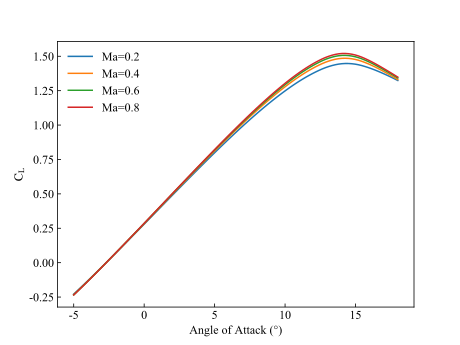
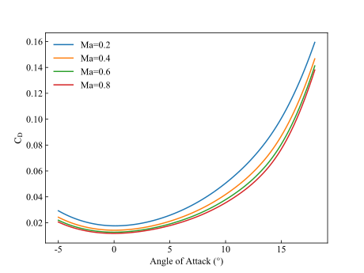
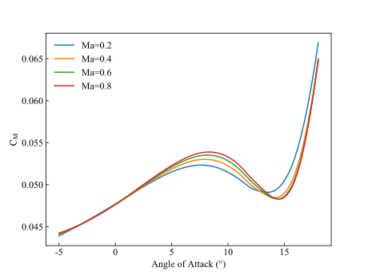
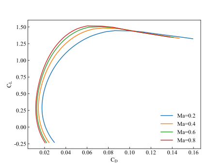

# vr5_airfoilFOAM
**For personal use only in study and research.**

This project is under construction. If you are interested in the content, please email me.

## Some of the results

CL v AOA

CD v AOA

CM v AOA

CL v CD

Ma=0.4, AOA=5°

Ma=0.6, AOA=25°

Ma=0.8, AOA=20°

