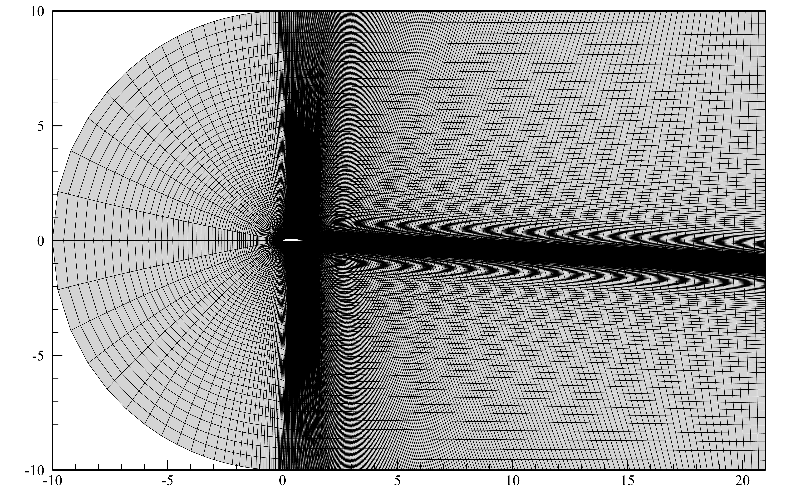
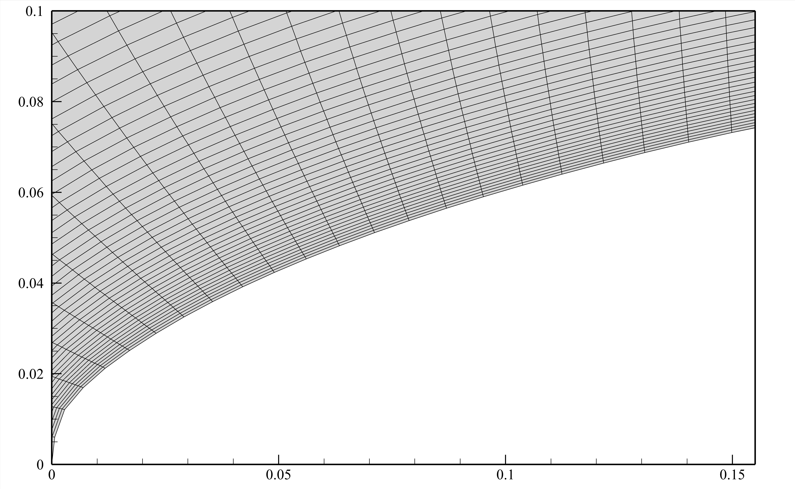

# vr5_airfoilFOAM
This is a simple 2D-airfoil CFD case using OpenFOAM v10. **Only use for study and research.**

## Mesh ( From [curiosityFluidsAirfoilMesher](https://github.com/curiosityFluids/curiosityFluidsAirfoilMesher) )

## Some of the results

CL v AOA

CD v AOA

CM v AOA

CL v CD

Ma=0.2, AOA=14°

Ma=0.4, AOA=5°

Ma=0.6, AOA=25°

Ma=0.8, AOA=20°

